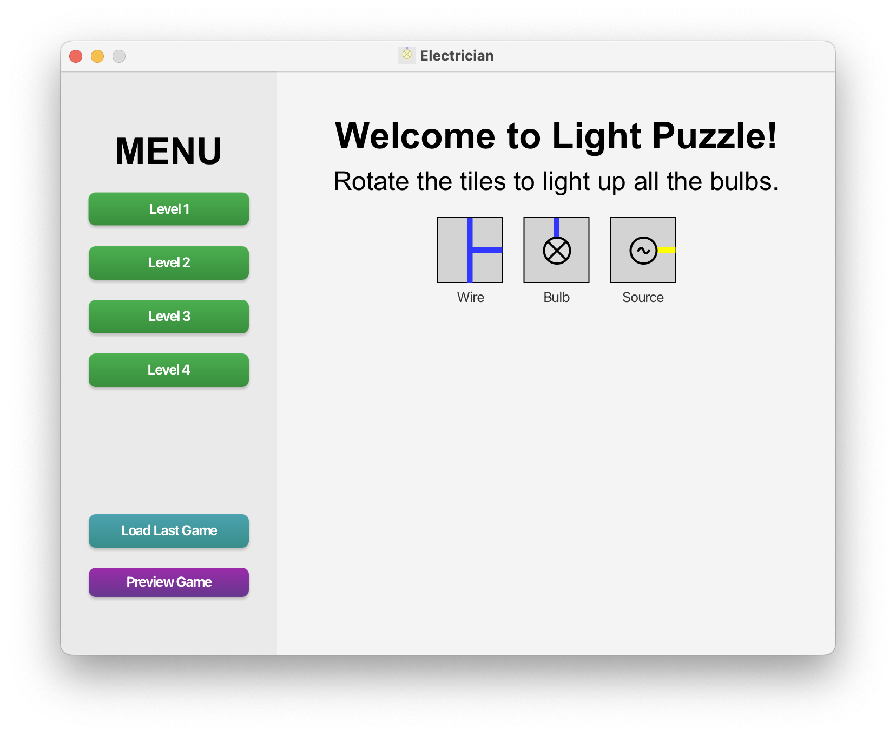
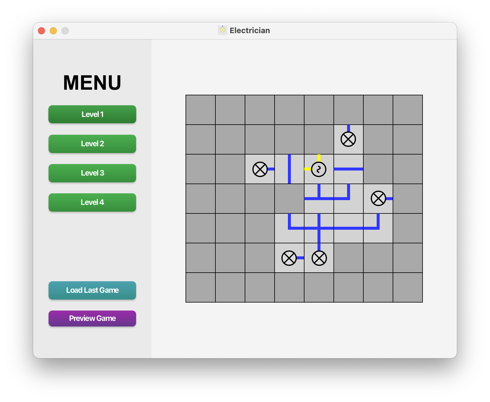
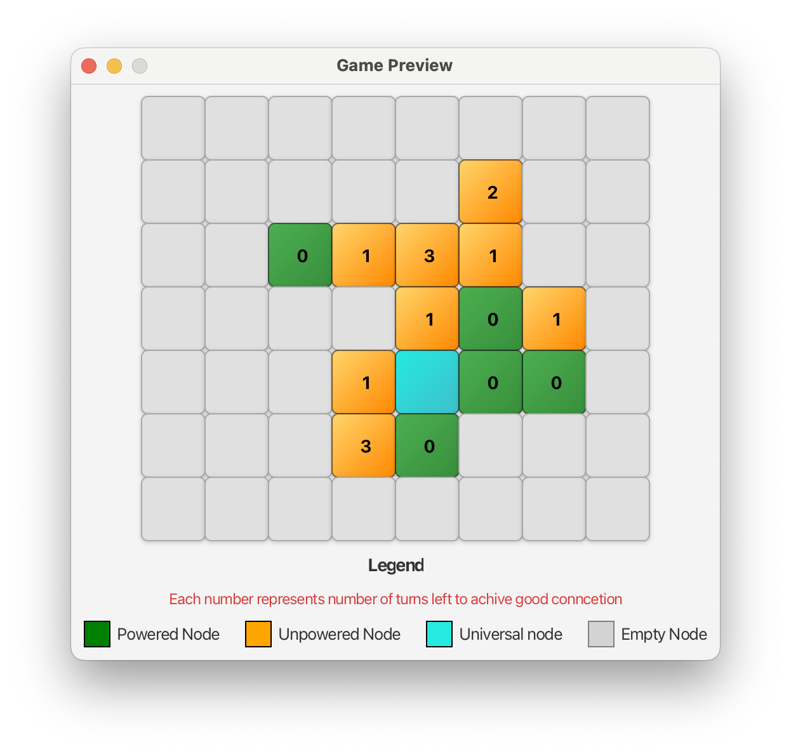
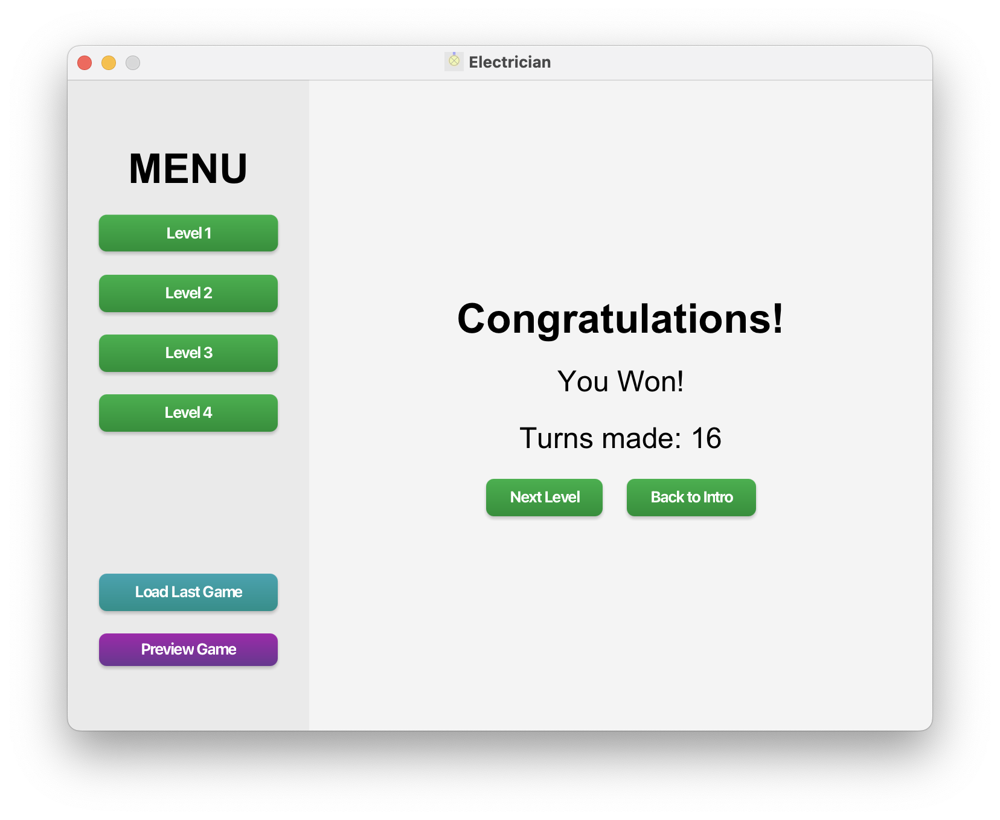

#  Wire puzzle game - Electrician
 - Final project for IJA at Faculty of Information Technology Brno University of Technology
 - For more information after compilation visit -> `/myapp/target/site/index.html`

- **Authors**: Marian Šuľa (xsulama00), Samuel Kundrát (xkundrs00)
- **Language**: Java
- **GUI**: JavaFx

## Table of Contents

- [Wire puzzle game - Electrician](#wire-puzzle-game---electrician)
  - [Description](#description)
  - [Project Structure](#project-structure)
  - [Levels](#levels)
    - [Example](#example)
    - [Level Syntax](#level-syntax)
    - [Node Types](#node-types)
    - [Coordinates](#coordinates)
    - [Connector Sides](#connector-sides)
  - [Startup Instructions](#startup-instructions)
  - [Maven Support](#maven-support)
- [App](#app)
  - [Intro](#intro)
  - [Level](#level)
  - [Preview](#preview)
  - [Win](#win)

## Description:
A wire puzzle game where the goal is to connect a power source to bulbs by rotating and placing wire connectors in a grid. The game uses an observer model and a node-based approach for managing the game state and user interface.

## Project Structure:
- **common**: Observer model and node model.
- **game**: Game logic and model.
- **gui**: Views and user interface.

## Levels:
Levels are stored in the `myapp/data` directory.

### Example
```
7 8
L 4 5 NORTH EAST SOUTH
L 5 5 NORTH EAST WEST SOUTH
L 5 4 EAST SOUTH
L 4 6 NORTH WEST
L 5 6 WEST EAST
L 3 6 NORTH SOUTH
L 3 4 EAST WEST
L 5 7 WEST NORTH
B 6 4 NORTH
B 3 3 EAST
B 2 6 SOUTH
B 4 7 SOUTH
P 3 5 WEST SOUTH
B 6 5 NORTH
```

### Level Syntax:
1. The first line contains the game size:
`<row> <column>`
2. Following lines define the nodes in the grid:
`<nodeType> <row> <column> <connector side>*`

### Node Types:
- **L**: Connector
- **B**: Bulb
- **P**: Power source

### Coordinates:
- **row**: The row number (integer).
- **column**: The column number (integer).

### Connector Sides:
- **NORTH**
- **EAST**
- **SOUTH**
- **WEST**

## Startup Instructions:
1. Navigate to the `myapp` directory.
2. Clean and build the project using Maven:
`mvn clean package`
3. Run the project with JavaFX:
`mvn javafx:run`


## Maven Support:
- The project supports **macOS** with **ARM CPU**.

# App
## Intro


## Level


## Preview


## Win


